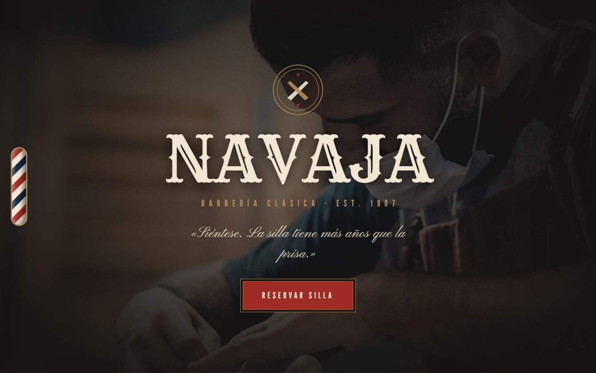
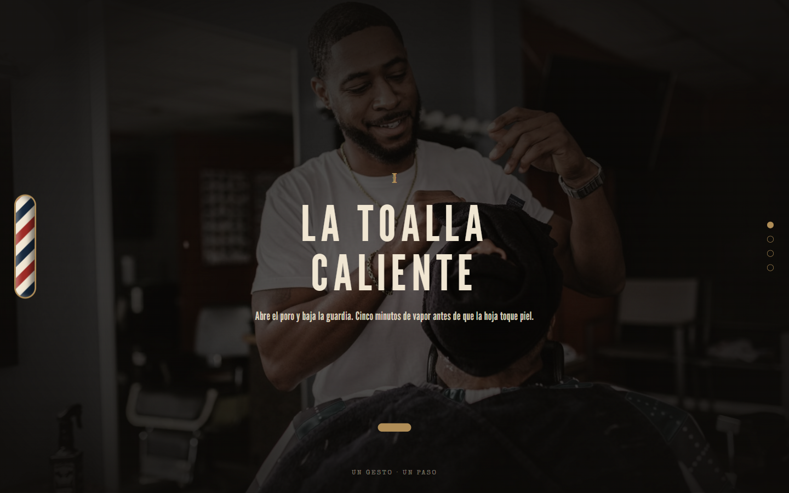

# NAVAJA · Barbería clásica (EST. 1987, Guadalajara)

Ver en vivo: https://angeljgc-dev.github.io/navaja-barberia/


Landing de una barbería clásica. La dirección de arte la saqué de paletas de barberías reales (espresso, navy, crema, oxblood, latón) y la navegación va por secciones tipo takeover.

| Hero | Sección |
| --- | --- |
|  |  |

## Técnicas

- GSAP Observer para el takeover de secciones completas: candado `animating` y liberación del scroll nativo al rebasar los extremos. El gotcha que me costó rato fue el orden: hay que llamar `scrollTo` ANTES de `overflow: hidden`, si no el scroll se congela a mitad.
- MorphSVGPlugin (`type: "rotational"`) morfando los iconos de oficio: navaja, tijera, brocha.
- El barber pole es CSS puro: animo `background-position` exactamente un periodo (79.2 px) para que el loop quede perfecto.

Aparte hay un image trail con rAF que sigue el cursor en la galería, la tipografía "Tonsorial Parlor" (Rye + League Gothic + Pinyon Script + Special Elite) y una sección que cuenta la historia real del poste de barbero.

## Cómo correr

```bash
npx http-server . -p 8080
```

## Licencia

Código bajo licencia [MIT](LICENSE). NAVAJA no es un negocio real, es una marca que inventé para el portafolio; cualquier parecido con una barbería de verdad es casualidad. Las fotos, videos y modelos 3D de terceros siguen con la licencia de sus autores (los pongo en Créditos).

## Créditos

Fotografía: [Pexels](https://www.pexels.com).

---
Ángel Josué García Canteros
